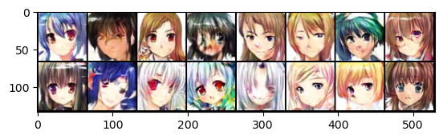
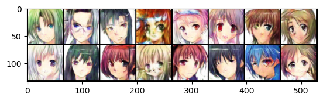

# Anime Face generator

Uses DCGAN (made from scratch) to create new Anime faces!

# Updates:
   ### 2/19/23
      1) Added multi GPU support for DCGAN!
   ### 2/6/23
      1) Added PGGAN Implementation for AnimeGAN!

## How to run?
**First, download the dataset from https://www.kaggle.com/datasets/splcher/animefacedataset and extract it to datasets/anime**

Go to [demo.ipynb](./demo.ipynb) and run the notebook! Adjust the `NUMBER_OF_IMAGES` variable to adjust on how many images to generate.

## Multi GPU Support
For Multi GPU DCGAN implementation, please run [DCGANmulti.py](./DCGANmulti.py)

## Pretrained models:
Pretrained models for both the discriminator and the generator are available .

## Training
1) Run [DCGAN.ipynb](./DCGAN.ipynb) notebook.
2) Adjust the number of epochs and batch size according to your preference.
3) Open Tensorboard to view the generated images as you train!
   
## References:
1) Spencer Churchill, &amp; Brian Chao. (2019). <i>Anime Face Dataset</i> [Data set]. Kaggle. https://doi.org/10.34740/KAGGLE/DS/379764
2) Radford, A., Metz, L., & Chintala, S. (2015). Unsupervised representation learning with deep convolutional generative adversarial networks. *arXiv preprint arXiv:1511.06434.*
